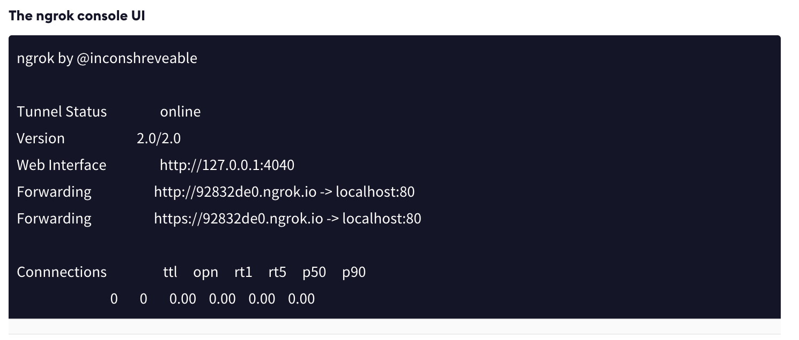
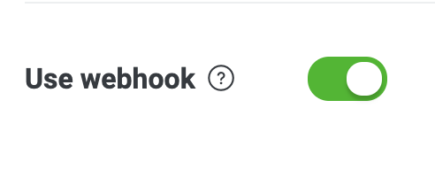

1. pipenv --python 3.7.8
2. pipenv shell
3. pipenv install line-bot-sdk==1.8.0 flask line-bot-sdk==1.8.0
4. download ngrok from https://bin.equinox.io/c/4VmDzA7iaHb/ngrok-stable-darwin-amd64.zip 
4. ./ngrok authtoken <your_auth_token>
5. ./ngrok http 80
6. python line.py
7. ngrok http 5000
8. update Webhook URL from Forwarding   ex:https://1234.ngrok.io paste up

9. enable use webhook

10. linebot test

